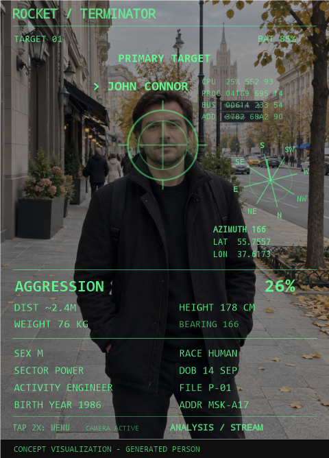

# Rokid Terminator HUD

A fan-made sci-fi HUD for **Rokid Glasses (RG-glasses, Android 12)**. It tracks a face with the glasses' camera, runs a short scan sequence, and draws a translucent reticle over the view. It is a playful visual demo, not a person-identification or safety tool.

**[Download the v0.7 APK](https://github.com/oldmelnick-afk/rokid-terminator-hud/releases/download/v0.7/rocket-terminator-hud-v0.7.apk)** · [Source ZIP](https://github.com/oldmelnick-afk/rokid-terminator-hud/releases/download/v0.7/rokid-terminator-hud-source-v0.7.zip) · [All releases](https://github.com/oldmelnick-afk/rokid-terminator-hud/releases)

*Promotional visualization: the person and street scene were generated, and the overlay was recolored green for the image. The installed v0.7 APK is unchanged. The dossiers shown are fictional.*

[View an unaltered screen capture from the glasses, with no face in view](screenshot-glasses-no-face.png). The digital capture appears white; the promotional image's green tint does not indicate a change to the app.

## What it does

- Searches for a face, scans for about four seconds, shows `SCAN COMPLETE`, then switches to `PRIMARY TARGET` and the film-style `JOHN CONNOR` label after about five seconds.
- Follows the face with a translucent reticle aimed toward the head. The reticle shrinks when the target is locked and disappears when the face is lost.
- Shows an approximate distance based on camera geometry. This is an uncalibrated estimate. Height, weight, address, birth date, sex, race and job are **fictional game data**, drawn from 16 distinct profile cards. A new capture draws another card; the app does not recognize a returning person.
- Gives a playful `AGGRESSION` score based on the face detector's smile probability. A locally detected raised middle finger briefly sets the score to 100%. It does not measure anyone's actual mood or intent.
- Refreshes the simulated `CPU / PROC / BUS / ADD` rows: every five seconds the block clears and the lines return from top to bottom. Numbers continue changing while visible.
- Rotates an eight-direction radar display from the glasses' rotation sensor. On the tested unit there is no magnetic compass, so its azimuth is **relative to the starting orientation**, not true north. The Moscow latitude and longitude are animated display values, not GPS.
- Processes camera frames locally with Android Camera2, ML Kit Face Detection and MediaPipe Hand Landmarker. No account or cloud connection is required; the app requests only camera permission.

## Install on Rokid Glasses

This APK is for the glasses, **not the companion iPhone app**. It was built and launched on `RG-glasses` running Android 12 with a 480×640 display. Other Rokid models are untested.

1. Download [rocket-terminator-hud-v0.7.apk](https://github.com/oldmelnick-afk/rokid-terminator-hud/releases/download/v0.7/rocket-terminator-hud-v0.7.apk) from the release assets.
2. Enable developer access / USB debugging on the glasses and connect them to a computer with Android Platform Tools (`adb`).
3. Install with `adb install -r rocket-terminator-hud-v0.7.apk`.
4. Open **Terminator HUD** from the glasses' Android app launcher and grant camera access.

Tap once to restart the scan. Double-tap within 400 ms to return to the launcher. The built-in Hi Rokid assistant has not been confirmed to launch third-party APKs by voice on this firmware.

**SHA-256:** `14FEC85247D52F8C2698767C824753996FE9600DFF64FFD0F6EBCF5E21B6C060`

## Build from source

Download and unpack the [v0.7 source ZIP](https://github.com/oldmelnick-afk/rokid-terminator-hud/releases/download/v0.7/rokid-terminator-hud-source-v0.7.zip). Install an Android SDK and a JDK supported by the Gradle wrapper. Open the project in Android Studio, or run `./gradlew :app:assembleDebug` (`gradlew.bat :app:assembleDebug` on Windows). The result is `app/build/outputs/apk/debug/app-debug.apk`. `build-preview.ps1` is a Windows helper; pass `-Offline` only after dependencies are cached.

The package ID is `com.rocketglasses.terminatorpreview`. The included `hand_landmarker.task` is used for local hand tracking.

## Scope and limitations

Version 0.7 was installed and launched on the glasses with an active camera and rotation sensor. An earlier version tracked a face shown in a photograph. Reticle alignment, behavior with multiple people, and the gesture response still need hands-on testing. Camera and eye viewpoints differ. This project is an unofficial fan-made demo and is not affiliated with Rokid or the Terminator film rights holders.
